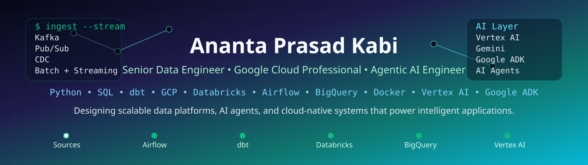

<div align="center">
<!-- Animated wave header -->

</div>

---
## [](https://github.com/anantkabi)

```python
from google.adk.agents import Agent

root_agent = Agent(
    name="Ananta_Prasad_Kabi",
    model="human_v1988.0",
    description="Senior Data Engineer building scalable data platforms and practical AI systems.",
    instruction="""
        Transform messy data into trusted platforms.
        Turn AI prototypes into production systems.
        Share everything learned along the way.
        Never give up your dreams.
    """,
    tools=[data_engineering, Python, SQL, Airflow, dbt , agentic_ai, databricks, google_cloud, open_source_llm],
)

# experience: 14+ years across Banking, Supply Chain, Media & Analytics
# specialties: ETL • GCP • SQL • Python • AI Engineering • Data Platforms
# certifications: Google Cloud Professional Architect • Professional Data Engineer • Generative AI Leader
# mission: Make enterprise Data Engineering and AI practical, scalable, and accessible.
```

---

## [](https://github.com/anantkabi)

<div align="left">

<!-- Cloud -->

<br>


<br>
<br>

<!-- AI & Agentic AI -->

<br>


<br>
<br>

<!-- Data Engineering -->

<br>


<br>
<br>

<!-- Programming -->

<br>


<br>
<br>

<!-- Databases -->

<br>


<br>
<br>

<!-- Libraries -->

<br>


<br>
<br>

<!-- DevOps & Tools -->

<br>


<br>
<br>

</div>

---

## [](https://github.com/anantkabi)

| Project | Description | Stack |
|---------|-------------|-------|
| [Cloud Ops Multi Agent System](https://github.com/anantkabi/cap_project) | Multi Agents system which will check and recommend suitable solutions for Data Engineering, Cloud Operations and SRE related issues from GitHub issues | `Google ADK` `Python` `GitHub MCP` `Google MCP Toolset` `Google Developer Knowledge` |
| [Apache Airflow + PostgreSQL Integration (Windows Docker)](https://github.com/anantkabi/airflow_postgress_connectivity_win_docker) | This repository demonstrates how to set up Apache Airflow using Docker on Windows, and run a DAG that connects to a PostgreSQL database to insert data. | `Apache Airflow` `Python` `PostgresSQL` `WindowsDocker` |
| [Google ADK Demo pipeline](https://github.com/anantkabi/Google_adk_open_ai_agentic_demo) | Demo Agent using Google ADK and Open AI | `ADK` `OpenAI` `Agentic AI` |
| [Multi Agent Enterprise Job Copilot](https://github.com/anantkabi/enterprise_job_copilot) | Multi Agent Job search engine for personalized job searching | `ADK` `Python` `Agentic AI` `MCP Integration` |
| [Open Source LLM Gemma3 setup in Ollama](https://medium.com/@kabi.anant/build-your-own-private-chatgpt-in-30-minutes-with-ollama-and-open-webui-b50318030340) | Demo to setup Gemma3 open source LLM model to host on Ollama on local machine | `Python` `Ollama` `Gemma3` `OpenWebUI` |
| [Integration of Open AI with Postgres to enable NLP](https://medium.com/@kabi.anant/integrating-llm-and-ai-capabilities-with-on-prem-applications-3016acc94b65) | Demo pipeline to integrate LLM and NLP capabilities with On-prem applications/databases | `Python` `Apache Airflow` `PostgresSQL` `Metabase` `SQL` `OpenAI` |

---


## [](https://github.com/anantkabi)

<details>
<summary><b>3x Google Cloud Certified + Apache Airflow + ClickHouse Fundamentals </b></summary>
<br/>
<div align="left">

<a href="https://www.credly.com/users/anantkabi/badges/credly"></a>
<a href="https://www.credly.com/users/anantkabi/badges/credly"></a>
<a href="https://www.credly.com/users/anantkabi/badges/credly"></a>
<a href="https://www.credly.com/users/anantkabi/badges/credly"></a>
<a href="https://www.credly.com/users/anantkabi/badges/credly"></a>

</div>
</details>

---

<div>

## [](https://github.com/anantkabi)

<!-- Social badges -->
<a href="https://www.linkedin.com/in/anant-kabi/"></a>
<a href="https://medium.com/@kabi.anant"></a>


<br><br>
"Learn, work and share knowledge!"

</div>

<meta name="google-site-verification" content="Wnq1_CIje1PNiYPnssPg8_eQdAyOsDXWJiZ-Lwpxrks" />
